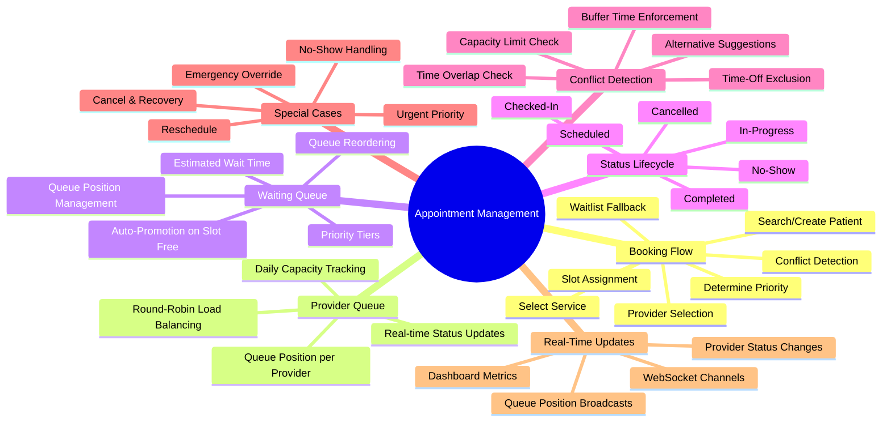
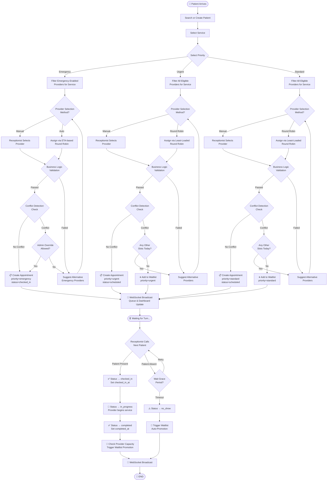
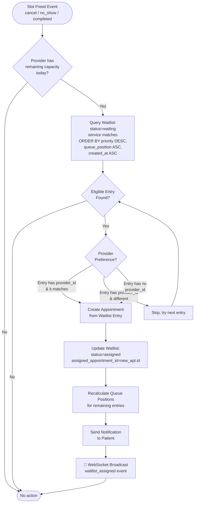
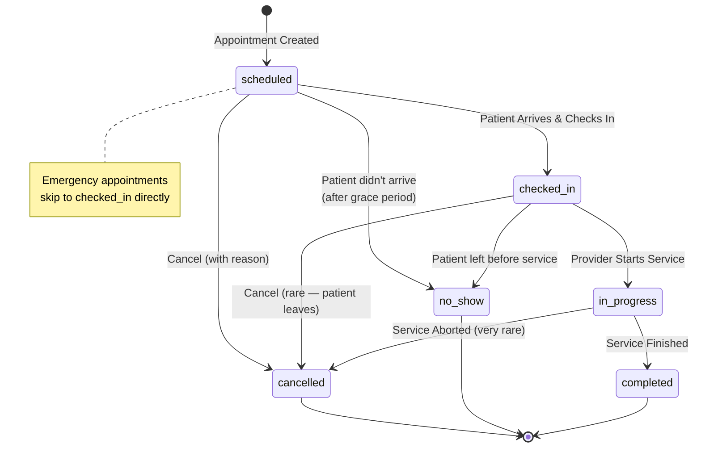
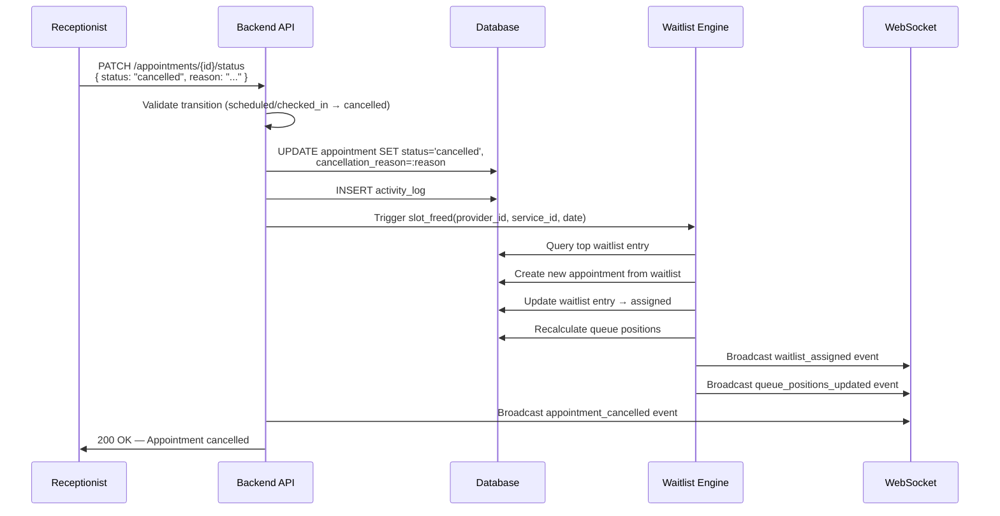
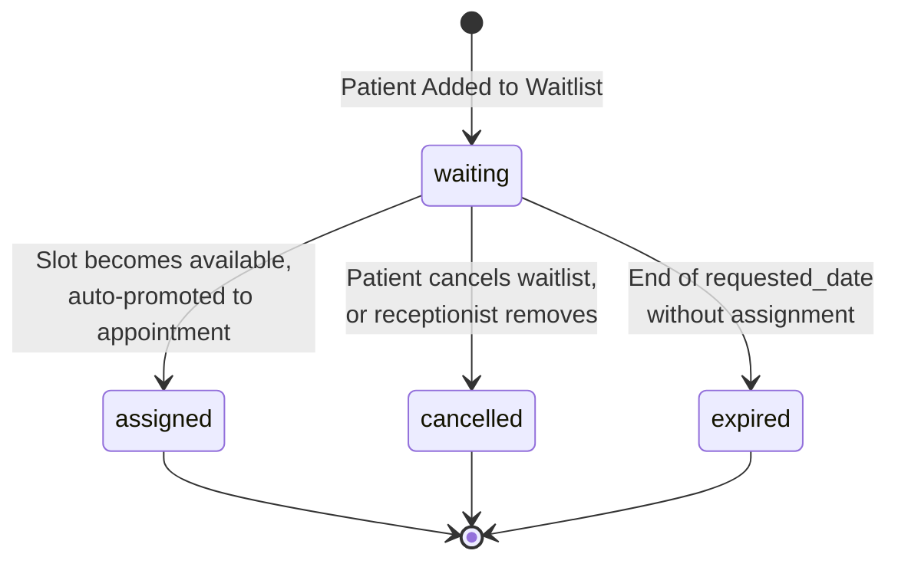

# MediSync — Appointment Management System Design

> A comprehensive design reference for building the appointment management feature end-to-end. Covers every perspective from patient arrival to service completion, including the updated scheduling algorithm, waitlist/queue management, conflict detection, real-time WebSocket updates, and edge-case handling.

---

## 1. High-Level Mind Map — Features to Implement



---

## 2. The Complete Appointment Lifecycle

A patient walks in → receptionists books an appointment → appointment enters the system → patient gets served → appointment completes. Here is every step explained.

### 2.1 Step-by-Step Walkthrough

| # | Action | Who | System Behavior | DB Impact |
|---|--------|-----|-----------------|-----------|
| 1 | **Patient Arrives** | Patient → Receptionist | Receptionist searches patient by phone/name/email | `SELECT` from `patients` |
| 2 | **Create Patient** (if new) | Receptionist | Fills patient form; system validates uniqueness | `INSERT` into `patients` |
| 3 | **Select Service** | Receptionist | Picks from active services catalog | `SELECT` from `services WHERE is_active = TRUE` |
| 4 | **Set Priority** | Receptionist | Chooses `standard` / `urgent` / `emergency` | Stored in request payload |
| 5 | **System Finds Providers** | System | Filters eligible providers (see §3) | `SELECT` from `providers` + `provider_services` + `availability` |
| 6 | **Select Provider** | Receptionist / Round-robin | Manual pick or auto-assign via least-loaded | — |
| 7 | **Verify Business Logic** | System | Validates capacity, availability, time-off | Multiple `SELECT` queries |
| 8 | **Conflict Detection** | System | Checks time overlap with existing appointments | Conflict query on `appointments` |
| 9a | ✅ **No Conflict** → Book | System | Creates appointment + generates `appointment_number` | `INSERT` into `appointments`, `activity_logs` |
| 9b | ❌ **Conflict** → Suggest | System | Returns alternative providers/times | No writes |
| 9c | ❌ **No Slots** → Waitlist | System | Adds patient to waitlist queue | `INSERT` into `waitlist` |
| 10 | **WebSocket Broadcast** | System | Publishes queue updates to all connected clients | — |
| 11 | **Patient Check-in Call** | Receptionist | When provider is ready, calls next patient | `UPDATE` appointment status |
| 12 | **Check-In** | Receptionist | Patient confirmed present | `status → checked_in`, set `checked_in_at` |
| 13 | **In Progress** | Provider/System | Provider begins service | `status → in_progress` |
| 14 | **Completed** | Provider/Receptionist | Service finished, patient checked out | `status → completed`, set `completed_at` |
| 15 | **Post-Completion** | System | Triggers waitlist auto-promotion if slots freed | Process waitlist queue |

---

## 3. Updated Scheduling Algorithm

The original flowchart has three parallel lanes by priority (Emergency, Standard, Urgent). Here is the **updated, optimized algorithm** that unifies the flow, adds waitlist integration, and handles all edge cases.

### 3.1 Algorithm Flowchart



### 3.2 What Changed from the Original Algorithm

| Area | Original | Updated |
|------|----------|---------|
| **Waitlist** | Not present | Full waitlist entry on slot exhaustion with priority ordering |
| **No-Show Handling** | Only status update | Grace period → no-show marking → automatic waitlist promotion to fill the freed slot |
| **Cancellation** | Not covered | Cancel releases the slot → triggers waitlist auto-promotion → WebSocket broadcast |
| **Emergency Override** | Implicit entry at `checked_in` | Explicit admin-override branch when conflict detected for emergency |
| **WebSocket** | Not present | Event broadcast after every status change for real-time queue/dashboard updates |
| **Capacity Check** | Not explicit | Integrated in business logic validation with `max_daily_appointments` |
| **Buffer Time** | Not mentioned | `appointment_end = start + duration_minutes + buffer_time_minutes` enforced in conflict check |
| **Post-Completion** | Ends at `completed` | Triggers provider capacity re-evaluation and waitlist promotion |

---

## 4. Conflict Detection — Deep Dive

### 4.1 What Constitutes a Conflict?

A proposed appointment slot `[new_start, new_end)` conflicts if **any** of these are true:

1. **Time Overlap** — Another active appointment for the same provider overlaps:
   ```sql
   SELECT 1 FROM appointments
   WHERE provider_id = :provider_id
     AND status NOT IN ('cancelled', 'no_show')
     AND appointment_start < :new_end
     AND appointment_end   > :new_start;
   ```

2. **Buffer Time Violation** — The `new_end` must include the service's `buffer_time_minutes`:
   ```
   effective_end = appointment_start + duration_minutes + buffer_time_minutes
   ```
   Store this as `appointment_end` in the DB so the conflict query above automatically accounts for buffers.

3. **Daily Capacity Exceeded** — Provider already has `max_daily_appointments` active bookings for that day:
   ```sql
   SELECT COUNT(*) FROM appointments
   WHERE provider_id = :provider_id
     AND DATE(appointment_start) = :target_date
     AND status NOT IN ('cancelled', 'no_show');
   ```

4. **Provider on Time-Off** — The slot falls within a `provider_time_off` range:
   ```sql
   SELECT 1 FROM provider_time_off
   WHERE provider_id = :provider_id
     AND is_approved = TRUE
     AND start_date <= :target_date
     AND end_date >= :target_date
     AND (start_time IS NULL OR start_time <= :slot_start_time)
     AND (end_time IS NULL OR end_time >= :slot_end_time);
   ```

5. **Provider Not Working** — The day is not a working day or slot is outside working hours:
   ```sql
   SELECT 1 FROM availability
   WHERE provider_id = :provider_id
     AND day_of_week = :day_of_week
     AND is_working_day = TRUE
     AND start_time <= :slot_start_time
     AND end_time >= :slot_end_time;
   ```

6. **Break Time Violation** — Slot overlaps provider's break period:
   ```
   IF break_start AND break_end:
     conflict IF slot_start < break_end AND slot_end > break_start
   ```

### 4.2 Conflict Resolution Options

When a conflict is detected, the system should return:

```json
{
  "conflict": true,
  "conflict_type": "time_overlap | capacity_exceeded | on_leave | outside_hours",
  "suggestions": {
    "alternative_providers": [
      { "provider_id": "...", "name": "Dr. X", "next_available": "10:30 AM" }
    ],
    "alternative_times": [
      { "start": "2026-03-23T11:00:00Z", "end": "2026-03-23T11:30:00Z" }
    ],
    "can_add_to_waitlist": true
  }
}
```

---

## 5. Business Logic Validation — The Checklist

Before even checking for conflicts, the system validates:

| # | Check | Query / Logic | On Failure |
|---|-------|--------------|------------|
| 1 | Patient exists & active | `patients.is_active = TRUE` | 404 — Patient not found |
| 2 | Service exists & active | `services.is_active = TRUE` | 400 — Service unavailable |
| 3 | Provider exists & status = `available` | `providers.status = 'available'` | 400 — Provider unavailable |
| 4 | Provider can deliver service | `provider_services` join exists | 400 — Provider not qualified |
| 5 | Provider specialization matches service | `provider.specialization_id` matches `service.required_specialization_id` | 400 — Specialization mismatch |
| 6 | For Emergency: `provider.emergency_enabled = TRUE` | Direct check | 400 — Provider not emergency-enabled |
| 7 | Appointment start is in the future | `appointment_start > NOW()` | 400 — Cannot book past time |
| 8 | Valid working hours for that day | `availability` check | 400 — Outside working hours |
| 9 | No approved time-off | `provider_time_off` check | 400 — Provider on leave |

---

## 6. Provider Selection & Round-Robin

### 6.1 Eligible Provider Filtering

```
Input: service_id, priority, target_date
Output: sorted list of eligible providers from best → worst

Steps:
1. Get providers linked to the service → JOIN provider_services
2. Filter: providers.status = 'available'
3. Filter: providers.is_active = TRUE (via users.is_active)
4. If priority = 'emergency': Filter emergency_enabled = TRUE
5. Exclude: providers on approved time-off for target_date
6. For each provider: count today's active appointments
7. Exclude: providers at max_daily_appointments
8. Sort by: appointment_count ASC (least loaded first)
```

### 6.2 Round-Robin Assignment

The "round-robin" is a **least-loaded-first** strategy:

```python
def select_provider_round_robin(eligible_providers):
    """
    Given a list of providers sorted by today's appointment count (ASC),
    select the provider with the fewest appointments.
    Ties are broken by: last appointment's end time (earliest first)
    so the provider who's been idle longest gets the next patient.
    """
    if not eligible_providers:
        return None  # → Waitlist

    # All have same count? Break tie by idle time
    min_count = eligible_providers[0].today_count
    tied = [p for p in eligible_providers if p.today_count == min_count]

    # Sort tied providers by their last appointment end (earliest = most idle)
    tied.sort(key=lambda p: p.last_appointment_end or datetime.min)
    return tied[0]
```

### 6.3 ETA-based Selection (Emergency)

For emergencies, sort by **Estimated Time to Available (ETA)**:

```
For each emergency-enabled provider:
  1. If currently idle → ETA = 0 → highest priority
  2. If in-progress → ETA = current_appointment.appointment_end - NOW()
  3. If has queued patients → ETA = last_queued_end - NOW()
  
Sort by ETA ASC → pick the soonest-available provider
```

---

## 7. Provider Queue — How Provider's Daily Queue Works

Each provider has a **daily ordered queue** of appointments. This is not a separate table — it's a **view** derived from the `appointments` table.

### 7.1 Provider Queue Query

```sql
SELECT a.*, p.name as patient_name, s.name as service_name
FROM appointments a
JOIN patients p ON p.id = a.patient_id
JOIN services s ON s.id = a.service_id
WHERE a.provider_id = :provider_id
  AND DATE(a.appointment_start) = :target_date
  AND a.status NOT IN ('cancelled', 'no_show')
ORDER BY
  CASE a.priority
    WHEN 'emergency' THEN 0
    WHEN 'urgent' THEN 1
    WHEN 'standard' THEN 2
  END,
  a.appointment_start ASC;
```

### 7.2 Queue Position Tracking

No separate `queue_position` column needed on appointments — position is derived:
- **Position** = row number in the ordered query above
- **Relative Position** = count of appointments with `status IN ('scheduled', 'checked_in')` before this one

### 7.3 Provider Capacity Display

```
Capacity: {active_today_count} / {max_daily_appointments}
Status colors:
  🟢 Green  → <70% utilized
  🟡 Yellow → 70-99% utilized  
  🔴 Red    → 100% (full)
```

---

## 8. Waiting Queue (Waitlist) — Deep Dive

The **waitlist** is for patients who could not get a slot. It is a separate table and separate concept from a provider's daily queue.

### 8.1 When Does a Patient Enter the Waitlist?

1. **All providers for the requested service are at capacity** for the target date
2. **All available time slots are conflicted** (fully booked)
3. **Receptionist explicitly opts for waitlist** (patient prefers to wait rather than see another provider)

### 8.2 Waitlist Entry Creation

```python
async def add_to_waitlist(patient_id, service_id, provider_id, priority, requested_date, notes):
    # 1. Calculate queue position within same priority tier
    current_max = await db.execute(
        SELECT MAX(queue_position) FROM waitlist
        WHERE service_id = :service_id
          AND status = 'waiting'
          AND priority = :priority
    )
    new_position = (current_max or 0) + 1

    # 2. Insert waitlist entry
    entry = Waitlist(
        patient_id=patient_id,
        service_id=service_id,
        provider_id=provider_id,     # NULL = any provider
        priority=priority,
        requested_date=requested_date,
        queue_position=new_position,
        status='waiting',
        notes=notes
    )
    db.add(entry)

    # 3. Log activity
    log_activity('create_waitlist', 'waitlist', entry.id, ...)

    # 4. WebSocket broadcast → queue updated
    await ws_broadcast('waitlist_updated', {
        'service_id': service_id,
        'new_entry': entry,
        'queue_size': new_position
    })
```

### 8.3 Queue Ordering Logic

The waitlist is ordered by a composite sort:

```
ORDER BY:
  1. priority    DESC  →  emergency(3) > urgent(2) > standard(1)
  2. queue_position ASC  →  lower position = earlier in queue
  3. created_at  ASC  →  first-come-first-served within same position
```

This means an **emergency** waitlist entry always jumps ahead of **urgent** and **standard** entries, regardless of when it was added.

### 8.4 Waitlist Auto-Promotion (Slot Freed)

When a slot becomes available (appointment `cancelled`, `no_show`, or `completed` with remaining capacity), the system auto-promotes from the waitlist:



### 8.5 Queue Position Recalculation

After any removal (assigned, cancelled, expired) from the waitlist, recalculate positions:

```python
async def recalculate_queue_positions(service_id: str):
    """Recalculate queue positions for all waiting entries of a service."""
    entries = await db.execute(
        SELECT * FROM waitlist
        WHERE service_id = :service_id
          AND status = 'waiting'
        ORDER BY
          CASE priority
            WHEN 'emergency' THEN 0
            WHEN 'urgent' THEN 1
            WHEN 'standard' THEN 2
          END,
          created_at ASC
    )
    for i, entry in enumerate(entries, start=1):
        entry.queue_position = i
    
    await db.commit()
    await ws_broadcast('queue_positions_updated', {...})
```

### 8.6 Estimated Wait Time

```python
def estimate_wait_time(queue_position, service_id, provider_id=None):
    """
    Rough estimate based on:
    - Average service duration for this service type
    - Number of people ahead in queue
    - Number of eligible providers currently serving
    """
    avg_duration = service.duration_minutes + service.buffer_time_minutes
    
    # How many providers can serve this service right now?
    active_provider_count = count_available_providers(service_id, provider_id)
    
    if active_provider_count == 0:
        return None  # Cannot estimate
    
    # Parallel processing: queue_position people, N providers
    estimated_minutes = (queue_position / active_provider_count) * avg_duration
    return estimated_minutes
```

---

## 9. Appointment Status State Machine



### 9.1 Valid Transitions Table

| From | Allowed To | Who Can Trigger | Side Effects |
|------|-----------|-----------------|--------------|
| `scheduled` | `checked_in` | Receptionist | Set `checked_in_at = NOW()` |
| `scheduled` | `cancelled` | Receptionist/Admin | Require `cancellation_reason`; free slot; trigger waitlist promotion |
| `scheduled` | `no_show` | Receptionist/System | Free slot; trigger waitlist promotion; send follow-up notification |
| `checked_in` | `in_progress` | Provider/Receptionist | — |
| `checked_in` | `cancelled` | Admin | Rare; require reason; free slot |
| `in_progress` | `completed` | Provider/Receptionist | Set `completed_at = NOW()`; update provider capacity; trigger waitlist promotion |
| `in_progress` | `cancelled` | Admin | Very rare edge case; require reason |

> [!CAUTION]
> **Invalid transitions must be rejected** by the API. For example: `completed → scheduled` is not allowed. The backend must enforce the state machine by validating `current_status → new_status` against the table above.

### 9.2 Emergency Appointments — Special Rules

- **Skip `scheduled`** — Emergency appointments are created with `status = checked_in` directly (the patient is already present and needs immediate attention)
- **Override capacity** — Admin can override `max_daily_appointments` for emergency cases
- **Priority queue jump** — Emergency appointments are placed at the front of the provider's queue, ahead of all `urgent` and `standard` appointments

---

## 10. Cancellation & No-Show Recovery

### 10.1 Cancellation Flow



### 10.2 No-Show Flow

```
1. Receptionist calls patient for their appointment
2. Patient doesn't respond / isn't present
3. Wait a grace period (configurable, e.g. 10 minutes)
4. Receptionist (or system timer) marks appointment as no_show
5. System:
   a. Updates appointment.status = 'no_show'
   b. Logs activity
   c. Triggers waitlist auto-promotion
   d. Queues a no_show_followup notification to the patient
   e. WebSocket broadcast: slot freed + queue updated
```

### 10.3 Reschedule Flow

Rescheduling is effectively **cancel + re-book**:

```
1. Cancel the original appointment (reason: "Patient rescheduled")
2. This triggers waitlist promotion for the freed slot
3. Create a new appointment for the new date/time
4. The new appointment goes through the full booking flow (conflict detection etc.)
5. Link the two via activity_log for audit trail
```

> [!TIP]
> A convenience `POST /appointments/{id}/reschedule` endpoint makes this atomic — it wraps both cancel and re-book in a single DB transaction, so if the new slot fails conflict detection, the original appointment is NOT cancelled.

---

## 11. Waitlist Status State Machine



---

## 12. WebSocket Architecture — Real-Time Updates

### 12.1 Why WebSocket?

The requirements demand real-time queue position updates, dashboard metrics refreshes, and provider status changes. Polling is inefficient for a multi-user healthcare system. WebSocket provides push-based updates.

### 12.2 Channel Architecture

```mermaid
flowchart LR
    subgraph Backend
        API[FastAPI API<br/>Endpoint Handler]
        ENGINE[Appointment<br/>Engine]
        WS_MGR[WebSocket<br/>Manager]
    end

    subgraph Channels
        CH1[provider:{provider_id}]
        CH2[dashboard:global]
        CH3[waitlist:{service_id}]
        CH4[queue:{provider_id}]
    end

    subgraph Clients
        C1[Receptionist<br/>Dashboard]
        C2[Provider<br/>Screen]
        C3[Admin<br/>Dashboard]
        C4[Waiting Room<br/>Display]
    end

    API --> ENGINE
    ENGINE --> WS_MGR
    WS_MGR --> CH1 & CH2 & CH3 & CH4
    CH1 --> C2
    CH2 --> C1 & C3
    CH3 --> C1 & C4
    CH4 --> C2 & C4
```

### 12.3 WebSocket Events

| Event Name | Channel | Payload | Triggered By |
|-----------|---------|---------|-------------|
| `appointment_created` | `provider:{id}`, `dashboard:global` | appointment details | New booking |
| `appointment_status_changed` | `provider:{id}`, `dashboard:global` | id, old_status, new_status | Status transition |
| `appointment_cancelled` | `provider:{id}`, `dashboard:global` | id, reason | Cancellation |
| `queue_updated` | `queue:{provider_id}` | provider queue list with positions | Any queue change |
| `waitlist_entry_added` | `waitlist:{service_id}`, `dashboard:global` | entry details, queue size | Waitlist addition |
| `waitlist_assigned` | `waitlist:{service_id}`, `dashboard:global` | waitlist_id, appointment_id, patient | Auto-promotion |
| `queue_positions_updated` | `waitlist:{service_id}` | list of {waitlist_id, new_position} | Reordering |
| `provider_status_changed` | `provider:{id}`, `dashboard:global` | provider_id, old_status, new_status | Status change |
| `capacity_updated` | `dashboard:global` | provider_id, current/max counts | Booking/completion |

### 12.4 Implementation Approach with FastAPI

```python
# WebSocket Manager (singleton)
class ConnectionManager:
    def __init__(self):
        # channel_name → set of WebSocket connections
        self.channels: dict[str, set[WebSocket]] = defaultdict(set)

    async def subscribe(self, websocket: WebSocket, channel: str):
        await websocket.accept()
        self.channels[channel].add(websocket)

    async def unsubscribe(self, websocket: WebSocket, channel: str):
        self.channels[channel].discard(websocket)

    async def broadcast(self, channel: str, event: str, data: dict):
        message = {"event": event, "data": data, "timestamp": utcnow().isoformat()}
        dead = []
        for ws in self.channels.get(channel, []):
            try:
                await ws.send_json(message)
            except WebSocketDisconnect:
                dead.append(ws)
        for ws in dead:
            self.channels[channel].discard(ws)

    async def broadcast_multi(self, channels: list[str], event: str, data: dict):
        """Broadcast to multiple channels at once."""
        for ch in channels:
            await self.broadcast(ch, event, data)

ws_manager = ConnectionManager()
```

```python
# FastAPI WebSocket endpoint
@router.websocket("/ws/{channel}")
async def websocket_endpoint(websocket: WebSocket, channel: str):
    await ws_manager.subscribe(websocket, channel)
    try:
        while True:
            # Keep connection alive; client can send pings
            data = await websocket.receive_text()
            if data == "ping":
                await websocket.send_text("pong")
    except WebSocketDisconnect:
        await ws_manager.unsubscribe(websocket, channel)
```

### 12.5 Integration Points — Where to Emit Events

Every mutation in the appointment/waitlist engine should emit events:

```python
# Inside the appointment service/engine
async def create_appointment(...):
    # ... validation, conflict check, DB insert ...

    # Emit events
    await ws_manager.broadcast_multi(
        channels=[
            f"provider:{appointment.provider_id}",
            f"queue:{appointment.provider_id}",
            "dashboard:global"
        ],
        event="appointment_created",
        data=AppointmentResponse.from_orm(appointment).dict()
    )
```

---

## 13. Appointment Number Generation

The `appointment_number` format is `APT-YYYYMMDD-NNN`:

```python
async def generate_appointment_number(db: AsyncSession, target_date: date) -> str:
    """Generate next sequential appointment number for the target date."""
    date_str = target_date.strftime("%Y%m%d")
    prefix = f"APT-{date_str}-"

    # Get the highest sequence number for this date
    result = await db.execute(
        SELECT(func.max(Appointment.appointment_number))
        .where(Appointment.appointment_number.like(f"{prefix}%"))
    )
    last = result.scalar()

    if last:
        seq = int(last.split("-")[-1]) + 1
    else:
        seq = 1

    return f"{prefix}{seq:03d}"
```

---

## 14. Database Transaction Strategy

> [!IMPORTANT]
> All appointment creation, cancellation, and waitlist promotion operations must be wrapped in a **single database transaction** to prevent race conditions.

### 14.1 What Must Be Atomic

| Operation | Steps in Single Transaction |
|-----------|---------------------------|
| **Book Appointment** | Validate → Conflict Check → Generate Number → Insert Appointment → Log Activity |
| **Cancel Appointment** | Validate Transition → Update Status → Log Activity → Check Waitlist → Promote if found → Log Promotion |
| **Waitlist Promotion** | Find Entry → Create Appointment → Update Waitlist Entry → Recalculate Positions → Log Activity |
| **Status Transition** | Validate Transition → Update Status → Set Timestamps → Log Activity |

### 14.2 Optimistic Locking for Concurrent Bookings

Two receptionists might try to book the same slot simultaneously. Use `SELECT ... FOR UPDATE` in the conflict detection query:

```sql
SELECT 1 FROM appointments
WHERE provider_id = :provider_id
  AND status NOT IN ('cancelled', 'no_show')
  AND appointment_start < :new_end
  AND appointment_end   > :new_start
FOR UPDATE;
```

The `FOR UPDATE` lock ensures only one transaction can proceed for overlapping time ranges.

---

## 15. API Endpoints Required

| Method | Endpoint | Description |
|--------|----------|-------------|
| `POST` | `/appointments` | Create appointment (full booking flow with conflict detection) |
| `GET` | `/appointments` | List appointments (with filters: date, provider, patient, status) |
| `GET` | `/appointments/{id}` | Get appointment details |
| `PATCH` | `/appointments/{id}` | Update appointment details |
| `PATCH` | `/appointments/{id}/status` | Status transition (check-in, complete, cancel, no-show) |
| `POST` | `/appointments/{id}/reschedule` | Atomic reschedule (cancel + re-book) |
| `GET` | `/appointments/providers/{id}/queue` | Get provider's daily queue |
| `GET` | `/appointments/providers/{id}/capacity` | Get provider capacity stats |
| `POST` | `/waitlist` | Add patient to waitlist |
| `GET` | `/waitlist` | List waitlist entries (with filters) |
| `GET` | `/waitlist/{id}` | Get waitlist entry details |
| `PATCH` | `/waitlist/{id}` | Update waitlist entry (priority, cancel) |
| `POST` | `/waitlist/{id}/assign` | Manual waitlist → appointment promotion |
| `DELETE` | `/waitlist/{id}` | Cancel/remove from waitlist |
| `GET` | `/waitlist/estimated-wait` | Get estimated wait time |
| `GET` | `/providers/{id}/available-slots` | Get available time slots for a provider on a date |
| `WS` | `/ws/{channel}` | WebSocket connection for real-time updates |

---

## 16. Backend Layer Structure (Where Code Goes)

```
app/
├── api/v1/
│   ├── appointments.py        ← REST endpoints
│   ├── waitlist.py             ← Waitlist REST endpoints
│   └── websocket.py            ← WebSocket endpoint
├── services/
│   ├── appointment_service.py  ← Booking engine, conflict detection, state machine
│   ├── waitlist_service.py     ← Queue management, auto-promotion
│   ├── scheduling_service.py   ← Provider selection, round-robin, slot generation
│   └── websocket_manager.py    ← WebSocket connection manager
├── crud/
│   ├── crud_appointment.py     ← DB queries for appointments
│   └── crud_waitlist.py        ← DB queries for waitlist
├── schemas/
│   ├── appointment.py          ← Already exists ✅
│   └── waitlist.py             ← Already exists ✅
└── models/
    ├── appointment.py          ← Already exists ✅
    └── waitlist.py             ← Already exists ✅
```

---

## 17. Summary — Key Principles

1. **Priority-driven ordering** — Emergency > Urgent > Standard, everywhere (provider queue, waitlist, auto-promotion)
2. **Buffer-inclusive conflict detection** — `appointment_end` always includes `buffer_time_minutes`
3. **Atomic transactions** — Every booking, cancellation, and promotion is a single DB transaction with row-level locking
4. **Automatic promotion** — When a slot frees up (cancel/no-show/complete), the waitlist engine auto-promotes the top eligible entry
5. **State machine enforcement** — Only valid status transitions are allowed; the API rejects invalid ones
6. **Real-time everywhere** — Every mutation triggers WebSocket broadcasts to relevant channels
7. **Emergency override** — Emergencies bypass normal capacity limits with admin approval and skip directly to `checked_in`
8. **Graceful degradation** — If WebSocket disconnects, clients can fall back to polling; if waitlist is empty, freed slots just remain open for new bookings
