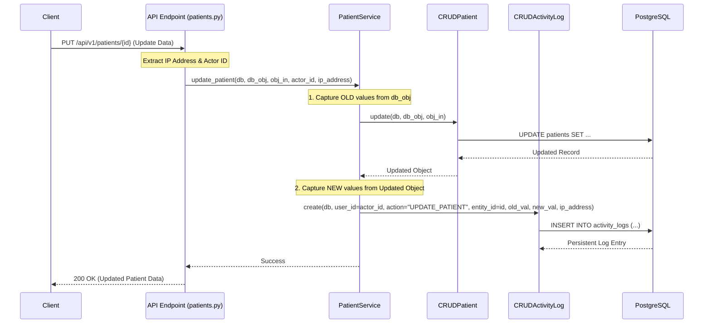

# Audit Logging System Architecture

The MediSync audit logging system is designed to provide a comprehensive, immutable trail of all security and data-sensitive actions. It follows a layered approach across the API, Service, and CRUD layers.

## 1. Architectural Layers

### A. API Layer (`app/api/v1/`)
- **Captures Context**: Extracts the client's **IP Address** from the [Request](file:///c:/Projects/MediSync/backend/app/schemas/user.py#46-51) object (`request.client.host`).
- **Identifies Actor**: Uses the [get_current_user](file:///c:/Projects/MediSync/backend/app/api/deps.py#16-52) or [get_current_active_admin](file:///c:/Projects/MediSync/backend/app/api/deps.py#54-71) dependency to identify who is performing the action.
- **Triggers Logic**: Calls the appropriate [Service](file:///c:/Projects/MediSync/backend/app/services/user_service.py#10-145) method, passing the `actor_id` and `ip_address`.

### B. Service Layer (`app/services/`)
- **Handles Business Logic**: Coordinate database operations through CRUD.
- **Calculates Diff**: Before updating a record, it captures the `old_val` from the database object and calculates the `new_val` after the update.
- **Centralized Logging**: Calls `UserService.log_activity` (the centralized hub) to create the log entry.

### C. CRUD & DB Layer (`app/crud/`, `app/models/`)
- **Persistence**: [CRUDActivityLog](file:///c:/Projects/MediSync/backend/app/crud/crud_activity_log.py#8-113) creates a record in the [activity_logs](file:///c:/Projects/MediSync/backend/app/api/v1/activity_logs.py#13-68) table.
- **Immutability**: Log records are typically never updated or deleted by the application once created.

---

## 2. Request-Response Audit Flow

The following diagram illustrates the flow of an update request (e.g., updating a patient record) becoming a persistent audit log:

---

## 3. Key Concepts

### Differential "Diff" Logging
Unlike simple event logs, we record both the **snapshot before** the change and the **snapshot after**. This allows administrators to see exactly which field was modified and what the previous value was, which is critical for clinical auditing.

### IP Forensic Capture
Every sensitive endpoint now requires the [Request](file:///c:/Projects/MediSync/backend/app/schemas/user.py#46-51) object. This ensures that even if a user is authenticated, we log the physical origin of the request, aiding in forensic investigations in case of account compromise.

### Relationship Mapping
Log entries are linked to the [users](file:///c:/Projects/MediSync/backend/app/api/v1/users.py#15-34) table via `user_id`, allowing the audit system to automatically resolve and display the actor's real name (e.g., "Dr. Smith") instead of just a raw ID in the Monitoring Dashboard.
